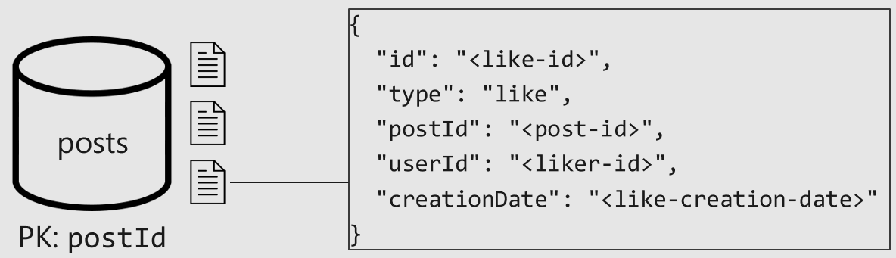

# sample-cosmosdb-fbook

CosmosDBのスキーマー設計は、RMDBと異なる部分があります。
RMDBの感覚でスキーマー設計をすると、RUを大きく消費したり、性能がでないケースがあります。

本入門では、Facebook的なアプリをサンプルにCosmosDBらしいスキーマ設計とは何かを学んでいただけます。

## Facebook的アプリとは

多くのユーザーがいて、ユーザーには友達がいて、記事を投稿できて、そこにLikeやコメントができ、ユーザーのトップページは記事一覧になっているアプリです。
このアプリをまずはRMDB的なスキーマー設計で作成し、それぞれの機能でのRU消費量とレスポンスを確認します。そこから各クエリとコマンドの結果を改善するには、どうスキーマーを書き換えて、どういうストアドプロシージャを作成するといいのかを見ていき、最後には同じアプリなのに設計（スキーマー、ストアドプロシージャ）が変わることで、消費RUが大幅に改善することを理解できます。

# 要件

`ユーザー` は、 `投稿` を作成できる。
ユーザーは、投稿に、 `Like` ができ、 `コメント` をつけられる。
トップページを表示すると最近の投稿一覧が表示される。
特定ユーザーのすべての投稿を一覧表示できる。投稿のすべてのコメントを一覧表示でき、Likeを押したユーザーを見れる。
投稿は、投稿者の名前とコメント数とLike数が表示される。コメントは、コメントの投稿者の名前も表示される。
一覧が表示されたとき、投稿は概要だけが表示される。

# 通常

この要件をみたすアプリケーションをモデルリングすると、下記のようなスキーマー構成にするかと思います。

しかし、CosmosDBでは、このモデリングでは性能が十分にでなかったり、課金額が高くなってしまいます。
この資料では、CosmosDBとしては、どうモデリングをしたらいいのかを考えていきます。

# アクセスパターンの整理

このアプリケーションを実現するには、どのようなリクエストがあるでしょうか。
大きく2つに分類できます。

* Command (書き込み処理)
* Query (読み取り専用)

この分類に基づいて、アプリで必要な処理を設計してみます。

* [C1] ユーザー情報の作成と編集
* [Q1] ユーザー情報の検索
* [C2] 投稿の作成と編集
* [Q2] 投稿の検索
* [Q3] ユーザー投稿の一覧
* [C3] コメントの作成
* [Q4] 投稿のコメントの一覧
* [C4] 投稿へのLike
* [Q5] 投稿のLike一覧
* [Q6] 直近X件の投稿一覧

こういった処理がCosmosDBに対して実行されることになります。

# CosmosDB のデータ格納

CosmosDBデータベースでは、ドキュメント  をコンテナー  に保存します。
Likeはテーブルに行を保存するのでしょか。

このように、ドキュメントとコンテナーを1対1で紐づけることを考えるかもしれません。

CosmosDBでは、こちらのほうがいいでしょう。

## 性能

予測性能は、プロビジョニングに依存します。
プロビジョニングは、秒間リクエスト単位・Request Units per second (RU/s)で表現できます。
CPU、メモリ、I/Oのリクエストコストを代替しています。

性能はプロビジョニングができます。プロビジョニング単位は、データベースレベルとコンテナーレベルで制御できます。プロビジョニング性能は、API経由でプログラムで変更できます。

この性能については、コスト削減には重要な話です。

## パーティショニング

CosmosDBは、データをパーティショニング分割して保存することで、水平スケーラビリティがあります。
コンテナーのパーティションキーに基づいて、データを論理的にパーティショングループに分けます。

素晴らしいパーティションキーは、ストレージの観点やスループットなどからとてもバランスが取れたパーティションのときです。
読み取りクエリは、一つのパーティションからすべての結果を取得すべきです。

# ベンチマークするデータ量

* 100,000ユーザー
* 5-50 投稿/ユーザー
* 0-20 コメント/投稿
* 0-100 like/投稿

# 始める前のデータ保存状況

ユーザーコンテナー（users）に、IDをパーティションキーにしてユーザードキュメントを保存します。

投稿コンテナー（posts）に、それぞれドキュメントを保存します。例えば投稿に関するドキュメントを保存した場合。

こちらは、コメントに関するドキュメントを保存した場合。

そして、Likeに関するドキュメントを保存した場合。

# 初めの段階での実装方法

## [C1] ユーザー情報の作成と編集

userドキュメントをusesコンテナーに格納します。これは特に問題ありません。

## [Q1] ユーザー情報の検索

usersコンテナーからパーティションキーのidで検索してuserを取得しています。これは特に問題ありません。

## [C2] 投稿の作成と編集

投稿をpostsコンテナーに登録します。これも特に問題ありません。

## [Q2] 投稿の検索

投稿者のIDで、usersコンテナーからPKであるidでフィルターして、ユーザー名を取得します。これは特に問題ありません。

投稿とコメント数とLike数を取得するために、postsコンテナーからPKであるpostIdでフィルターして、情報を取得します。これも特に問題ありません

## [Q3] ユーザー投稿の一覧

Facebookのトップページの用にフォローしているユーザーの投稿一覧と各投稿のコメント数とLike数を取得します。
各投稿の投稿者名とコメント数、Like数を取得するために、投稿数分繰り返しクエリを実行します。
これは読み取り数が多くなり性能問題につながります。

投稿を取得するために、postsコンテナーからPKではないuerIDでフィルタリングをしています。これは全件アクセスする必要があり、非常にコストがかかります。

## [C3] コメントの作成

コメントをpostsコンテナーに登録します。これは特に問題ありません。

## [Q4] 投稿のコメントの一覧

特定の投稿につけられたコメント一覧を取得するために、postsコンテナーからpkのpostIDでフィルタリングして情報を取得しています。これは特に問題ありません。

コメント者名を取得するために、コメント数分usersコンテナーからpkでフィルタリングして結果を取得しています。これはN+1になるのでコストがかかり問題があります。

## [C4] 投稿へのLike

Likeをpostsコンテナーに登録します。これは特に問題ありません。

## [Q5] 投稿のLike一覧

特定の投稿に紐づいたLikeをpostsコンテナーからPKのpostIdでフィルタリングして結果を取得しています。これは特に問題ありません。

Like者名を取得するために、Like数分usersコンテナーからpkでフィルタリングして結果を取得しています。これはN+1になるのでコストがかかり問題があります。

## [Q6] 直近X件の投稿一覧

各投稿の投稿者名とコメント数、Like数を取得するために、投稿数分繰り返しクエリを実行します。
これは読み取り数が多くなり性能問題につながります。

直近の投稿を取得するために、postsコンテナーからpkではないtypeでフィルタリングして結果を取得しています。これは非常にコストがかかります。

# 改善をしていく

一回のリクエストで複数のクエリを実行する問題がありました。また、パーティションキーではない条件で絞り込む、パーティションスキャンを引き起こす問題のあるクエリもありました。
それでは、それぞれ改修していきましょう。

## 非正規化

改修をするには非正規化を活用します。
ストアドプロシージャーを使うことで、同じロジカルパーティション内で非正規化ができます。

* Javascriptで書く
* 一つの論理パーティションを対象とする
* アトミックトランザクションとして実行する

## [Q3] ユーザー投稿の一覧

Facebookのトップページの用にフォローしているユーザーの投稿一覧と各投稿のコメント数とLike数を取得します。

そして問題となったのは下記でした。

> 各投稿の投稿者名とコメント数、Like数を取得するために、投稿数分繰り返しクエリを実行します。
> これは読み取り数が多くなり性能問題につながります。
>投稿を取得するために、postsコンテナーからPKではないuerIDでフィルタリングをしています。これは全件アクセスする必要があり、非常にコストがかかります。

この問題を解決するために、非正規化をしていきます。
投稿ドキュメントに、ユーザー名、コメント数、Like数を持たせます。

コメントドキュメントに、コメント者名を持たせます。

Likeドキュメントに、Likeした人の名前を持たせます。

